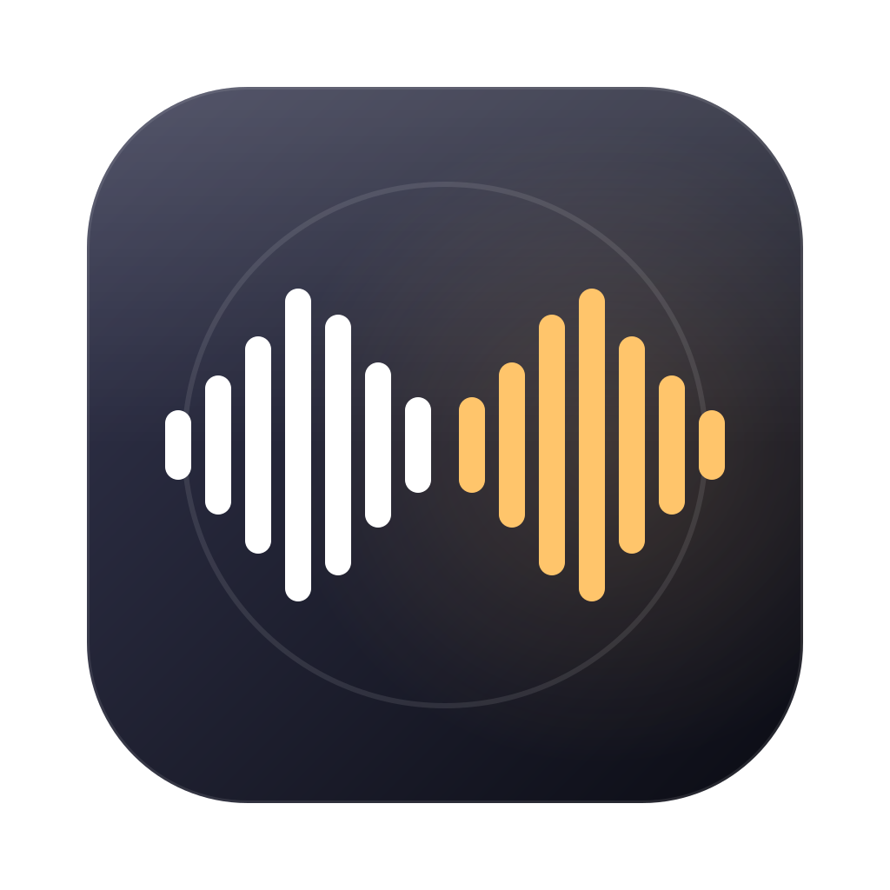

# 耳语同传 Hushpiece — 本机双向会议同传



和外语同事开会时用，支持企业微信、飞书、钉钉、腾讯会议、微信、Zoom、Teams 等任何会议软件：

- **对方说外语** → 屏幕上的字幕浮窗实时显示你的语言（附原文）
- **你说母语** → 自动翻译，用对方语言的语音通过虚拟麦克风送进会议，对方直接听到译文
- 浮窗里也可以打字，回车后用对方的语言念出来
- 每次会议自动保存双语对照记录（只存文字，不存录音）

语音识别、翻译、语音合成全部用 macOS 26 自带的本机模型：不需要 API key、不联网、不收费。

支持的语言（任意两种互译）：中文（普通话、台湾）、英语（英国、美国、澳大利亚、印度）、日语、韩语、法语、德语、西班牙语、意大利语、葡萄牙语。`hushpiece langs` 列出全部。

## 原理

```
对方声音（ScreenCaptureKit 系统音频） → 对方语言识别 → 翻译 → 字幕浮窗
你的麦克风 → 你的语言识别 → 停顿断句 → 翻译 → 译文语音 → 虚拟麦克风（会议软件的麦克风）
                       └──── 你的原声也同时送进虚拟麦克风（播报译文时自动压低）
```

- **只在有人听时播报**：会议软件没把麦克风设成虚拟麦克风时，译文只显示不播报（避免会前把身边的说话声翻出去）。字幕窗顶部会提示“会议软件还没把麦克风设成 …”。
- **回声保护**：外放时，对方说话期间暂停识别你的麦克风；检测到耳机（蓝牙 / USB / 耳机孔）时自动关闭。
- **断线自动重连**：点了菜单栏紫色录制图标的“停止”，1 秒左右自动连回。
- **结束不会卡死**：每一步都有时限，6 秒内一定保存记录。

## 安装

```sh
brew install --cask blackhole-2ch    # 虚拟麦克风（需要管理员密码）；装完 hushpiece devices 里看不到就重启一次电脑
scripts/install.sh                    # 编译、签名，装到 /Applications/Hushpiece.app，并把 hushpiece 命令链接进 PATH
```

第一次打开“耳语同传”会出现使用引导：选语言 → 下载模型 → 麦克风权限 → 录屏与系统录音权限 → 虚拟麦克风 → 试一试 → 设置会议软件。每一步自动检测是否完成。

权限跟着“启动它的程序”走：从 Finder 打开时授权给“耳语同传”；从终端运行 `hushpiece run/start` 时用终端的权限。

## 使用

1. 点菜单栏的声波图标 → **开始同传**，屏幕底部出现字幕窗。
2. 在会议软件里把麦克风选成虚拟麦克风（BlackHole 2ch），扬声器保持耳机或电脑扬声器。
3. 结束：字幕窗右上角“结束”，或菜单 → 结束同传。记录在菜单 → 会议记录。

字幕窗：

- 左侧大字是对方的话（你的语言），小字是原文；`…` 结尾的是还没说完的实时预览
- 右侧琥珀色是你的话的译文（对方听到的内容）
- 顶栏：正在听什么 / 语言对 / “翻译我的话”开关 / 字号 / 紧凑模式（一行电影字幕） / 隐藏（同传继续） / 结束
- 没有关闭按钮：隐藏后点菜单栏图标 → 显示字幕窗即可恢复

菜单栏菜单：开始/结束、显示字幕窗、翻译我的话、对方说 / 我说（语言）、只听某个软件、会议记录、设置、使用引导。

设置：通用（登录时启动、只在有人听时播报）、语言与声音（麦克风、译文输出设备、原声直通、回声保护、语音和语速试听）、字幕（字号、透明度、紧凑模式）、会议记录、高级（命令行和 MCP 配置一键复制）。

## CLI（`hushpiece`，旧名 `calltrans` 仍可用）

| 命令 | 作用 |
|---|---|
| `hushpiece app` | 打开菜单栏 App（和双击 App 一样） |
| `hushpiece start [选项]` / `stop` / `status` | 开始（App 在运行时交给它）/ 结束 / 状态 |
| `hushpiece run [选项]` | 前台运行一次同传，结束即退出 |
| `hushpiece say "文本"` | 让对方听到这句话（不是对方语言的先翻译；`--raw` 不翻译） |
| `hushpiece setup` / `doctor` / `devices` / `langs` | 使用引导 / 自检 / 列设备 / 列语言 |
| `hushpiece translate "文本" [--from zh] [--to en]` | 文本翻译 |
| `hushpiece transcribe 文件 [--lang ja-JP] [--translate] [--to zh]` | 音频文件识别（+翻译） |
| `hushpiece tts "text" [--lang en-GB] [--output default\|设备] [--save x.caf]` | 试听译文语音 |
| `hushpiece sessions` / `transcript [ID] [--last N]` / `export [ID]` | 会议记录（export 输出 Markdown） |

同传选项（不写就用 App 设置）：`--remote-lang en-GB`、`--my-lang zh-CN`、`--app 企业微信`、`--mic 名称`、`--output 名称`、`--voice Daniel`、`--rate 1.0`、`--no-passthrough`、`--echo-guard auto|on|off`（`--no-gate` = off）、`--always-speak`、`--subtitles-only`、`--no-overlay`、`--font-size 20`。测试用：`--remote-file`、`--mic-file`、`--mic-file-delay`。

数据目录：`~/Library/Application Support/Hushpiece/`（`sessions/*.jsonl|.md`、`hushpiece.log`、`status.json`）。设 `HUSHPIECE_HOME` 可以改到别处（自测用它隔离）。

## MCP

```sh
claude mcp add hushpiece -- hushpiece mcp                 # 只读
claude mcp add hushpiece -- hushpiece mcp --allow-write   # 允许 say_in_call
```

工具：`status`、`doctor`、`list_sessions`、`get_transcript`、`translate_text`，以及需要 `--allow-write` 的 `say_in_call`。

## 自测

```sh
scripts/selftest.sh
```

全程无人值守，在临时数据目录里跑，不会混进你的会议记录：用系统语音生成英文和中文音频，扬声器播放英文测系统声音采集 → 字幕；把中文文件当麦克风输入测 → 译文；测 `say` 和 MCP；再把虚拟麦克风的输出录回来重新识别，确认对方真的听到了译文。

## 已知限制

- 本机翻译适合日常商务对话，专有名词、口语偶尔生硬
- 一句话说完、停顿约 0.9 秒后才播报译文（句末有句号时 0.4 秒）
- 外放时，回声保护会在对方说话期间暂停识别你；双方抢话时以对方为准。建议戴耳机
- macOS 限制每个 App 同时占用 5 种语言的识别模型；切换语言时会自动释放不用的

## 品牌

图标源文件在 `Resources/Brand/`：`icon.svg`（大尺寸）、`icon-small.svg`（16/32 px 简化版）、`menubar.svg`（菜单栏模板图）。白色声波 = 原话，琥珀色 = 译文。
